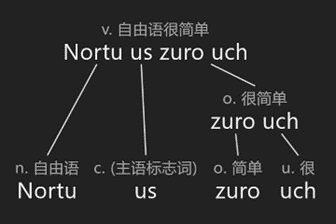

# 自由语（Nortu）语法基础

## 一、成分

### 1. 词、语块

这是一段自由语文本：

no's zu nuo-suzt ınvor sun. vuc o'ousr nuos ıngvoz e▼

> no's zu nuo-suzt ınvor sun 我正在阅读这本词典/词汇书
>
> vuc o'ousr nuos ıngvoz e 记住更多的词是很好/很值得做的

我们来把它分成一个个的【词】。

自由语中，粗略来说，词和词之间由空格隔开，比如ınvor sun就是两个词。有的词是缩略形式，和其他词连在一起，虽然中间没有逗号，但还是看成两个词，比如no's（实际上是no us）、o'ousr（实际上是ons ousr）。被“-”连起来的话，则整个看作是一个词，比如nuo-suzt；而如果是分开写成nuo suzt，则是两个词。

对于ınvor sun▼，我们可以认为sun是在修饰ınvor，它整体的重心是ınvor这部分。这种“谁修饰谁”、“谁是重心”的逻辑问题在语言文本中几乎无处不在。为了更好地分析理解这些逻辑，接下来我们引入【语块】的概念。

> ınvor sun v. 正在阅读

下图是一个简单的例子：

zuro和uch合成zuro uch，而Nortu、us、zuro uch又一起合成整句话。像这样一张图中的每一个节点，我们都可以当作一个语块。语块不是随心所欲的，必须有一定的逻辑关系，比如我们不能说us zuro是一个语块。

语块可以很大，你把一个段落都当作一整个语块某种程度上都是可以的；语块也可以很小，甚至比一个词还小，比如nuos▼这个词我们可以进一步拆分为nuo这部分和·s这部分，这种拆分是有逻辑意义的（·s修饰nuo，重心在nuo上），因此这比词还小的两部分也是语块。

> ·s o. 表复数
>
> nuos n. 词(复数)

词是文本的一种基础单位，而语块并不是一种固定大小的单位，它在性质上和词完全不同，语块可能是多个词/一个词/一个词的一部分。语块这个概念将让我们跳脱大小单位的思维限制，让我们更加简单地理解文本的语言逻辑：我们能看得出“谁修饰谁”、“谁是重心”等等就足以让我们理解语义、接近本质了，不像传统的语法思维一样先入为主地纠结各种具体概念。

### 2. 语块分类

按属性，语块可以简单分为七种：名块（n.）、动块（v.）、形容块（o.）、副块（u.）、介块（z.）、连块（x.）、其他块（c.）。

语块有大有小，但无论nuos中的nuo，还是zu nuo-suzt▼这个整体，我们都能感到它语义上都是在表达某个事物/概念，就像通常我们说的“名词”一样，这种我们就叫它【名块】。同样地，无论ınvor还是ınvor sun，都是在表达具体动作做什么，这种我们叫它【动块】。【形容块】则是那种专门修饰名块的，表达一些性质，比如nev、ongız等。【副块】则是修饰动块或形容块的（有的也能修饰名块），比如ucur uch▼或ıoz uch▼中的uch。

> zu nuo-suzt n. 这本词典/词汇书
>
> ucur uch v. 很喜欢
>
> ıoz uch o. 很好

上述四种块之外，还剩下一些特殊的语块。一种是【介块】，通常不单独使用，而是和名块或动块组合在一起，整体变成形容块或副块，比如zoug'st uıgr▼中的ust、ongues ot ıut ugno▼中的ot、vıgur nı nonu▼中的nı；另一种是【连块】，将左右两个相通属性的块合起来，整体仍然是那个属性，比如ono oı nouc▼的oı。而连这两类语块都算不上的就更为特殊了，那就简单归为【其他块】，具体用法具体分析。

> zoug'st uıgr v. 往哪里走
>
> ongues ot ıut ugno n. 那个世界的语言(复数)
>
> vıgur nı nonu n. 飞翔(为内容)的梦
>
> ono oı nouc n. 太阳和月亮

这些分类有一定的模糊性和边界情况，有时候你可能觉得一个语块是这种块或者那种块都说得通（比如zu nuo-suzt的zu，可以理解为名块/形容块），这很正常：只要说得通，那么就算对，只要最终你能正确地理解语义和逻辑就行。

有时候自由语中会用“xx词”之类的概念，比如名词，指的是通常作为名块的词。自由语中动词、形容词、副词、介词、连词、其他词同理。

### 3. 词的基本组合规则

自由语中，如果两个词能有效地组成语块，通常是符合一定的规则的。比如Nortu onusg▼，其中Nortu和onusg都是名词，那么正常来说应该前面的名词修饰后面的名词，重心在后者，最终整体还是名块。

> Nortu onusg n. 自由语语法

这样的规则下面将写为n. + **`n.`** ⇒ n.，其中 **`这样的部分`** 是重心，被其他部分修饰，最后整体的属性和重心部分的属性一致（重心是名块，最后整体也是名块）。

如果没有重心，如下面的o. + o. ⇒ o.，组成部分之间没有修饰关系（理解成相互修饰也行）。

注意，这不是什么万能公式，不代表随便两个词都能组合成语块，还是得符合正常的语义的，比如Nortu u就不是一个正常的语块。

自由语中词与词的一些基础的组合规则如下：

n. + **`n.`** ⇒ n.，比如Nortu onusg、unzov uzgo▼。

> unzov uzgo n. 手机游戏

n. + **`v.`** ⇒ v.，其中名词是动词的目标对象，比如ıo nıgur▼、suzt outr▼。

v. + **`n.`** ⇒ n.，其中名词是动词的行为主体，比如ucur nız▼、vıgur zov▼。

v. + **`v.`** ⇒ v.，和英语/中文的顺序是相反的（中文说“喜欢睡觉”，在自由语中则是“睡觉喜欢”），比如nozr ucur▼、ursgor sucur▼。

> ıo nıgur v. 等你
>
> suzt outr v. 找书
>
> ucur nız n. (对什么)喜欢的人
>
> vıgur zov n. 飞鸟
>
> nozr ucur v. 喜欢睡觉
>
> ursgor sucur v. 尝试运动

n. + **`o.`** ⇒ o.，比如uoch ıoz▼、uro ıngız▼。

o. + **`n.`** ⇒ n.，比如ıoz suzt▼、zurch zosug▼。

v. + **`o.`** ⇒ o.，比如unır xuız▼、ono ıougı▼。

o. + o. ⇒ o.，其中两个形容词地位平等，比如onuz nunch▼、rougn nunz▼。

> uoch ıoz o. 运气好
>
> uro ıngız o. 水(有些/比较)冷的
>
> ıoz suzt n. 好书
>
> zurch zosug n. 奇怪的问题
>
> unır xuız o. 跑步快的
>
> ono ıougı o. 太阳(光)明亮的
>
> onuz nunch o. 美好而舒服的
>
> rougn nunz o. 困难且不好的

**`n.`** + u. ⇒ n.，比如nıdun nudu▼、oundt ungu▼，或许较为费解，后面在副块部分会具体解释。

**`o.`** + u. ⇒ o.，比如ıoz uch、rougn ıosu▼。

**`v.`** + u. ⇒ v.，比如ucur uch、nozr unnu▼。

> nıdun nudu n. 还只是小孩
>
> oundt ungu n. 只是下属
>
> rougn ıosu o. 太难的
>
> nozr unnu v. 好好睡觉

介词、连词、其他词的情况较为复杂，后面将在其对应语块的部分具体展开。

一些规则的核心部分（谁修饰谁、谁是重心、最后整体会是什么属性）一定程度上是通用的，比如ıougu nozr sou▼中，ıougu nozr▼是动块，修饰后面的动块sou，最后整体也是动块，重心在sou上，这大致符合v. + **`v.`** ⇒ v.。

> ıougu nozr v. 在白天睡觉
>
> ıougu nozr sou v. 想在白天睡觉

### 4. 补充

语块这个概念对其他语言也适用。以英语为例：replay可以看作是re这个副块修饰play这个动块，最后replay整个是动块；play again可以看作是again这个副块修饰play这个动块，最后play again整个是动块。前者是语素（morpheme）组成词，后者是词组成短语，按传统的语言学会把这两种组成的过程分成两套系统，但其实它们是有很多共通之处的，语块便是着眼于这种共通之处。

## 二、名块

### 1. 单复数

自由语中，对一个名词xxx而言，它的复数（也就是想说多个xxx的话）是xxxs（读音多加上/s/）或xxx-us（读音多加上/ı s/），比如ordu是蘑菇，ordus是一些蘑菇。xxxs和xxx-us整体是名词，其中s和-us部分修饰xxx。注意，如xout这种以/te/结尾的，变成xouts后不能像英语的习惯一样读/xu ts/，而是读/xu te s/，除了一些已经十分固定的复数词（如uts读/a ts/、ıuts读/ya ts/、suts读/sa ts/）。

复数一般直接用xxxs；如果xxx本身以s结尾（再加s的话两个/s/音会碰在一起）或者xxxs是一个已经存在的词时（会混淆）用xxx-us。

要具体说明数量，在名词前面加数值即可（最终整体是名块）：

写法 | 读法
:- | :-
u ordu | /a o ru da/
1 ordu | /ya ts o ru da/
4 ordu | /xo ts o ru da/

注意：①单个的情况有两种写法，可以把1换成u；②数值和非数值之间要多读一个/ts/（u除外）；③自由语中不会重复表达复数，4 ordu中4本身就表明这是多个了，因此ordu不用累赘地变成ordus。

有时还会用到诸如untz、guc之类的单位，则加在中间，形如4 untz unv、4 guc ucgı。要分清数值和非数值部分，如4 zun untz unv中，4 zun是数值，untz unv都视为非数值，因此读的时候/ts/加在4 zun和untz unv中间（4和zun、untz和unv之间都不加/ts/），也就是/xo zang ts ang ts ang vu/。而形如4 zun untz unv这样的语块中，4修饰zun，4 zun修饰untz，4 zun untz修饰unv。

和英语等语言不同，所谓“可数名词”（比如cot是一个个的，可以有u cot、cots、4 cot等）的单数在自由语中是可以直接用的（比如直接可以说no's cot zogr），不用非要加u之类的进行所谓“限定”。

而自由语中使用复数，是有意要表达复数/那个事物通常都是复数（比如zots）。如果不需要表达复数则不用复数（以下三个例子都语法正确）：

例子 | 隐含的意思
:- | :-
no's cot zogr | 一个或者多个蛋都行
no's u cot zogr | 一个蛋就行
no's cots zogr | 需要不止一个蛋

### 2. 人称

词 | 含义 | 词 | 含义
:- | :- | :- | :-
no | 我 | ouc | 我们
ıo | 你 | vou | 你们
zo | TA | zos | TA们
ut | 它 | uts | 它们

自由语中原则上不分所谓性别，也不像英语等语言一样人称词有主格宾格之分。

自由语中有一个叫做“nız”的概念，大致可翻译为“人”，指的是具备“人格”的、包括人在内的高级智慧生命（除了人以外，还包括各种存在于设定中的外星人、兽人、智械等）。这里“我/你/TA”的范畴是即是nız，以及还算不上nız的但是你希望差不多算作nız的（如宠物）；而“它”则包括剩下那些达不到你想称为“TA”但是需要用到第三人称的，不仅包括具体的生命/事物，也包括抽象的概念，大致相当于英语的it。

形如no xxx后面接上名块的时候，这些人称词则是形容词，意思为“~的”，如no unzov。

### 3. 这/那

词 | 含义 | 词 | 含义
:- | :- | :- | :-
zu | 这 | zus | 这些
ıut | 那 | ıuts | 那些
ox | the xxx | oxs | the xxxs

zu(s)、ıut(s)、ox(s)单独使用都是语法正确的，但ox(s)几乎不用于单独使用，因为这时通常用ut(s)。

组合的用法（其中zu cots和zus cot都是语法正确的，不过复数只能用一次，要么加在zu上要么加在cot上）：

例子 | 意思
:- | :-
zu cot | 这个蛋
zu cots | 这些蛋
zus cot | 这些蛋

ox xxx的意思等同英语the xxx，而复数的话自由语除了ox xxxs也可以说oxs xxx（后者虽然语法正确但几乎不用）。

除此之外，还有形如no ox xxx的用法，和no xxx相似但有区别：

例子 | 隐含的意思
:- | :-
no nızn | 车肯定是属于我的
no ox nızn | 车不一定属于我，但是和我有关联（比如是我正在坐的车），我可以用“我的”来表达出这种关联

形如no ox xxx最典型的用法是用于那些比当事人更大的概念（而且非常确信后者并不是自己的所有物），如no ox urzon（我乘坐的列车）、no ox uzron（我来自的/身份所在的/当前所在的国家）、no ox und（我所信仰的神）。注意这些并不一定代表这个概念拥有当事人、当事人归属于这个概念（比如no ox uzron不代表我一定是这个国家国籍的人，可能只是当前居留的、自己在几个选项中选择的等等）。形如no ox xxx这样的语块中，ox修饰xxx，no修饰ox xxx。

### 4. 组合规则

一般的两个名词在一起遵循n. + n. ⇒ n.，而多于两个名词直接连在一起的话存在歧义，比如sougn ourug nuın，你不知道是sougn ourug+nuın（公众权利的法律）还是sougn+ourug nuın（公众的权利法）。

为了解决歧义需要明显区分成两部分名块，有多种方法：

- 中间加o（o读/o/，纯粹用于切分语法块），如sougn o ourug nuın（优先组合ourug nuın）或sougn ourug o nuın（优先组合sougn ourug），最后组合o这里。

- 用ot（相当于英语of，具体到介块部分会详细讲），如nuın ot sougn ourug（优先组合sougn ourug）或ourug nuın ot sougn（优先组合ourug nuın）。

- 把需要优先组合的部分加上“-”变成词，如sougn ourug-nuın或sougn-ourug nuın。

之前所讲的数值、人称、这/那都可以修饰后面的名词，而这三者可以同时使用，而且原则上这三者之间不会有直接的修饰关系（如4 no cut中4不修饰no），具体组合规则是优先组合右边，如no ıut 4 cut中，4修饰cut，ıut修饰4 cut，no修饰ıut 4 cut。（或者你也可以看成no ıut 4整体组成了一个如同形容块的语块，共同修饰cut）

数值、人称、这/那这三者任何先后顺序都语法正确，这意味着no ıut 4 cut、no 4 ıut cut、ıut no 4 cut、ıut 4 no cut、4 no ıut cut、4 ıut no cut都对（而且意思一样）。

不过注意，no ox xxx用法的顺序是固定的。这里ox一般不能放no前面，是因为no xxx优先组合，而这部分的意思表明了xxx是属于自己的；如果变成了ox no xxx，意思就变成了“那属于我的xxx”。 

其他不需要纠结太多，能正确表达想表达的意思、不产生歧义即可。

### 5. 转化为名词

对动词/形容词xxx而言，xxxud转为名词且基本意义不变（读音则后面连着加/aı/），如ucur（读/a ca ru/）变为ucurud（读/a ca raı/）、nev（读/ne vu/）变为nevud（读/ne vaı/）。

如果原本的词以u结尾，那么直接后面加d变成ud，如uncu变为uncud。

如果xxxud是已经存在其他意思的词，则使用xxx-ud；如果两个xxx变成xxxud会长得一样（如noz和nozu，都可能变为nozud），那么两个都用xxx-ud（noz变为noz-ud、nozu变为nozu-ud）。
